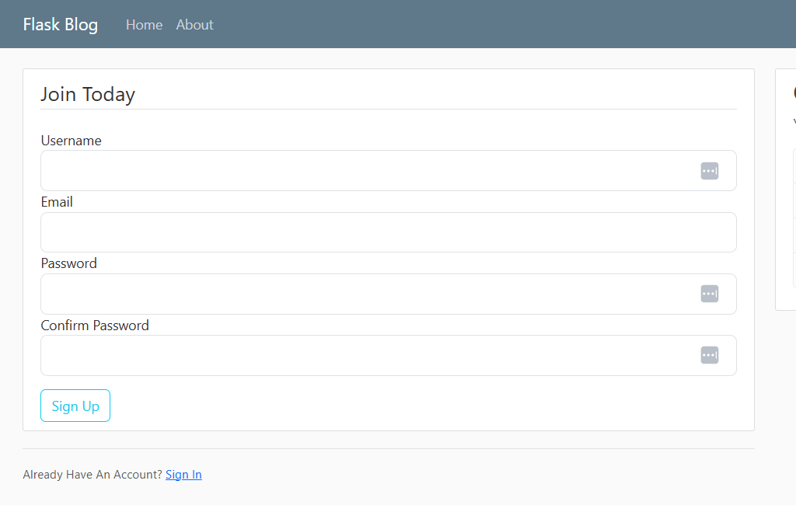

# Flask_Blog 🚀

Welcome to Flask_Blog! This project was developed as a way to get re-acquainted with the Flask web framework, building upon an older tutorial originally designed for Flask version 1 and Bootstrap version 4. It has since been updated and modernized with newer technologies.

As someone with extensive experience in Django, this project served as a practical exercise to explore the nuances of Flask and integrate modern Python development tools.

Note: This project is not intended for production use; it is a learning exercise and should be treated as such. However it is at a stage where it can be deployed for educational purposes or as a starting point for further development.

## Key Updates and Modernizations 🛠️

The original project underwent several key modifications:

* **Framework & Language Update:** Migrated from Flask 1 to **Flask 3.1.1** and **Python 3.12.4**.
* **Frontend Styling:** Upgraded from Bootstrap 4 to **Bootstrap 5**.
* **Development Environment:** Incorporated **UV** for robust virtual environment management and package installation.
* **Code Quality:** Integrated **Ruff** for comprehensive linting and code formatting, ensuring consistency and maintainability.
* **Enhanced CLI Output:** Utilized the **Rich** package for improved visual feedback in the terminal, notably for displaying the project's directory structure.

## Tech Stack 💻

* **Backend:** Python 3.12.4, Flask 3.1.1
* **Frontend:** HTML5, CSS3, Bootstrap 5
* **Templating:** Jinja2
* **Virtual Environment & Packaging:** UV
* **Linting & Formatting:** Ruff
* **CLI Enhancement:** Rich
* **Database:** SQLite (as indicated by `site.db` in the project structure)

## Features ✨

* User Registration
* User Login & Logout
* Password Reset (via email typical for a blog)
* Email Notifications with Flask-Mail & Tokens (for password reset)
* Create, Read, Update, and Delete (CRUD) Blog Posts (implied, typical for a blog)
* Display of Blog Posts on the Homepage with Pagination
* Display of Blog Post by Author
* User-specific content (e.g., account page)
* Custom Error Pages (e.g., 404 Not Found)
* Route Protection (e.g., login required for certain pages)

## Project Structure Overview 📂

A custom script `tree.py` (utilizing the `Rich` library) was created to visualize the project's directory structure in the terminal. Here's an example of its output:

## Application Screenshots 📸

Here's a glimpse of the Flask_Blog application:

### Home Page

*The main page displaying blog posts.*

### Login Page

*User authentication page.*

### Registration Page

*New user sign-up page.*

---

This README provides a snapshot of the Flask_Blog project, its purpose, and the technologies involved. Feel free to expand on sections like Setup, Installation, and Usage as needed!
